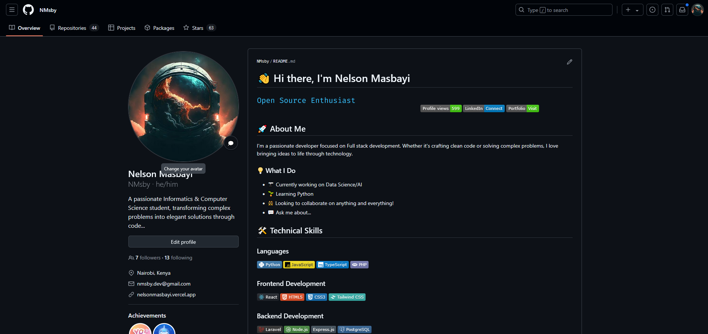

# 🌟 GitHub Profile README Template

A modern, feature-rich template for your GitHub profile README with dynamic content, stats visualizations, and more.



## ✨ Features

- 🎨 **Modern Design** - Clean layout with visual elements that highlight your work
- 📊 **GitHub Stats** - Dynamic stats cards showing your GitHub activity
- 🐍 **Contribution Snake** - Animated contribution graph visualization
- 🖋️ **Typing Effect** - Custom animated text introducing yourself
- 🔢 **Profile Views Counter** - Track how many people visit your profile
- 🎵 **Now Playing Widget** - Show what you're listening to on Spotify
- 📱 **Activity Tracker** - Automatically updated recent activity section
- 🏆 **Project Showcases** - Highlight your best work with star counters

## 🚀 Getting Started

1. **Create your profile repository**: Make a new repo with the same name as your GitHub username
2. **Copy the template**: Use the README template and customize it for your profile
3. **Follow the setup guide**: See [SETUP-GUIDE.md](SETUP-GUIDE.md) for detailed instructions

## 📝 Customization

This template is designed to be easily customizable:

- Replace personal information, links, and descriptions
- Update technical skills badges to match your expertise
- Feature your own projects and repositories
- Choose different color themes for the statistics cards

Detailed customization instructions are available in the [setup guide](SETUP-GUIDE.md).

## 🎭 Showcase

Here are some profiles using this template:

- [Original by Nelson Masbayi](https://github.com/NMsby)
- [Coming soon - Submit yours!]

## 📜 License

This template is available under the Creative Commons Attribution 4.0 International License.

**Attribution Required**: If you use this template, please include the following line in your README:

```
⭐️ Template inspired by [Nelson Masbayi](https://github.com/NMsby)
```

## 📦 What's Included

- `README.md` - The main template file with placeholders
- `SETUP-GUIDE.md` - Detailed instructions for setting up each component
- `.github/workflows/snake.yml` - GitHub Action for generating the contribution snake
- `LICENSE` - License file with attribution requirements
- `examples/` - Example screenshots and previews

## 📊 Version

**Current Version**: 1.0.0

See [CHANGELOG.md](CHANGELOG.md) for version history and updates.

## 🤝 Contributing

Contributions welcome! Feel free to:
- Submit your profile in the showcase section
- Suggest new features or improvements
- Report bugs or issues with the template

## 🔗 Resources

- [GitHub Profile README Collection](https://github.com/abhisheknaiidu/awesome-github-profile-readme)
- [Shields.io](https://shields.io/) - For creating custom badges
- [GitHub Readme Stats](https://github.com/anuraghazra/github-readme-stats) - For stats cards

---

Created with ❤️ by [Nelson Masbayi](https://github.com/NMsby)
